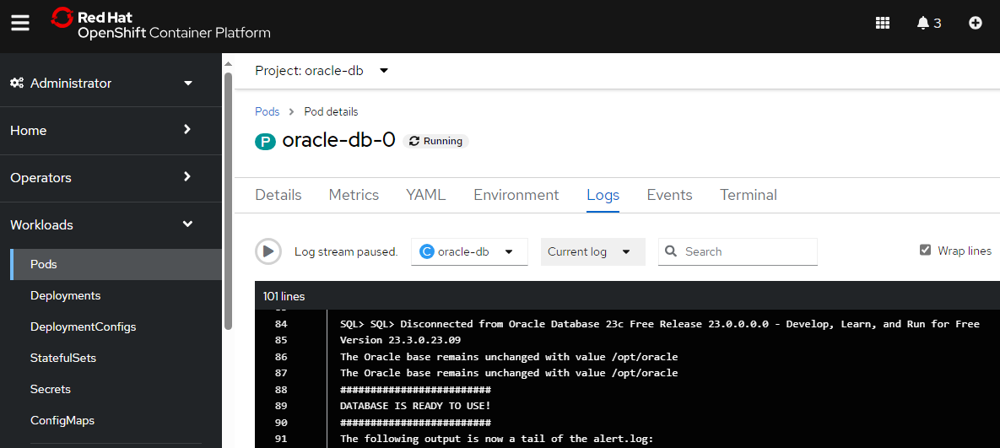

# Running Oracle Database 23c Free on OpenShift

## Background

This guide provides instructions for getting the free version of Oracle Database 23c running on OpenShift 4.14. Oracle make a [free version of their database](https://www.oracle.com/database/free/) available for download. It is available in VM or [container](https://container-registry.oracle.com/ords/ocr/ba/database/free) form factors, and the container version includes instructions for running locally using Podman. However, it does not include instructions for running on OpenShift. There are also several [documented restrictions](https://www.oracle.com/database/free/faq/) on the usable memory, storage and compute when using the free version which make it most suitable for development or test scenarios.

Running on OpenShift is not straightforward due to the security requirements and this guide documents the process by providing the definitions to create the components needed. Be aware that this is designed to be used in a PoC, demo, development or test environment and not in production.

## Steps to Create the Oracle DB

First, create a new project (namespace) in which to run everything:

`oc new-project oracle-db`

```text
Now using project "oracle-db" on server "https://example.cloud.com:32226".

You can add applications to this project with the 'new-app' command. For example, try:

    oc new-app rails-postgresql-example

to build a new example application in Ruby. Or use kubectl to deploy a simple Kubernetes application:

    kubectl create deployment hello-node --image=k8s.gcr.io/e2e-test-images/agnhost:2.33 -- /agnhost serve-hostname
```

Next, you create a Service Account which you will use to run the database:

`oc create sa oracle-sa`

```text
serviceaccount/oracle-sa created
```

As Oracle runs with the user and group id `54321`, you now need to add the `anyuid` Security Context Constraint (SCC) to the Service Account. This allows the database to run under its required user and group IDs:

`oc adm policy add-scc-to-user anyuid -z oracle-sa`

```text
clusterrole.rbac.authorization.k8s.io/system:openshift:scc:anyuid added: "oracle-sa"
```

To see the effect of this, you can run the following command to observe that the Service Account has permissions to use the `anyuid` SCC:

`oc adm policy who-can use scc anyuid`

```text
resourceaccessreviewresponse.authorization.openshift.io/<unknown>

Namespace: oracle-db
Verb:      use
Resource:  securitycontextconstraints.security.openshift.io

Users: ...
       system:serviceaccount:oracle-db:oracle
       ...
```

Now you create a secret to store the default password for Oracle to use by replacing `[your_password_here]` in the command below with the password of your choice:

`oc create secret generic oracle-db-pass --from-literal=password=[your_password_here]`

```text
secret/oracle-db-pass created
```

Finally you can apply the yaml file in the `config` folder in this repo to deploy Oracle. Note that this file assumes a `storageClassName` of `ocs-storagecluster-ceph-rbd` by default to provide `ReadWriteOncePod` (RWOP) storage. If your RWOP storage class has a different name, please change the `storageClassName` to the one for your environment.

`oc apply -f ./config/deploy-oracle23-db-free.yaml`

```text
service/oracle-db-svc created
persistentvolumeclaim/oracle-db-pvc created
statefulset.apps/oracle-db created
```

It will take several minutes before Oracle is ready to use, but any subsequent restarts will be much faster. The first time it runs it takes time to pull the Oracle container images and then more time to copy the database files into the dynamically allocated storage. You can watch the logs by running `oc logs oracle-db-0 -c oracle-db -f` to view the progress. If all goes well you should see output similar to this abbreviated output:

```text
Specify a password to be used for database accounts. Oracle recommends that the password entered should be at least 8 characters in length, contain at least 1 uppercase character, 1 lower case character and 1 digit [0-9]. Note that the same password will be used for SYS, SYSTEM and PDBADMIN accounts:
Confirm the password:
Configuring Oracle Listener.
Listener configuration succeeded.
Configuring Oracle Database FREE.
Enter SYS user password:
*******
Enter SYSTEM user password:
******
Enter PDBADMIN User Password:
******
Prepare for db operation
7% complete
Copying database files
29% complete
Creating and starting Oracle instance
30% complete
43% complete
Completing Database Creation
47% complete
Creating Pluggable Databases
71% complete
Executing Post Configuration Actions
93% complete
Running Custom Scripts
100% complete
Database creation complete. For details check the logfiles at:
 /opt/oracle/cfgtoollogs/dbca/FREE.
Database Information:
Global Database Name:FREE
System Identifier(SID):FREE
Look at the log file "/opt/oracle/cfgtoollogs/dbca/FREE/FREE.log" for further details.

Connect to Oracle Database using one of the connect strings:
     Pluggable database: oracle-db-0/FREEPDB1
     Multitenant container database: oracle-db-0

SQL*Plus: Release 23.0.0.0.0 - Production on Sat Mar 23 14:22:14 2024
Version 23.3.0.23.09

Copyright (c) 1982, 2023, Oracle.  All rights reserved.


Connected to:
Oracle Database 23c Free Release 23.0.0.0.0 - Develop, Learn, and Run for Free
Version 23.3.0.23.09

SQL>
System altered.

SQL>
Pluggable database altered.

SQL>
PL/SQL procedure successfully completed.

SQL> SQL>
Session altered.

SQL>
User created.

SQL>
Grant succeeded.

SQL>
User altered.

SQL> SQL> Disconnected from Oracle Database 23c Free Release 23.0.0.0.0 - Develop, Learn, and Run for Free
Version 23.3.0.23.09
The Oracle base remains unchanged with value /opt/oracle
The Oracle base remains unchanged with value /opt/oracle
#########################
DATABASE IS READY TO USE!
#########################
The following output is now a tail of the alert.log:
...
```

Press `ctrl-c` to quit following the logs.

## Connecting to Oracle

Once Oracle is running you can connect to it using the steps below.

Firstly, if you have a file of SQL commands that you want to run to configure Oracle you can copy them into the pod like this, assuming the file is called `oracle.sql`:

`oc cp oracle.sql oracle-db-0:/opt/oracle/oradata/oracle.sql -c oracle-db`

Next you will `rsh` into the Oracle pod so you can run `SQL*Plus` commands:

`oc rsh -c oracle-db oracle-db-0`

```text
sh-4.4$
```

At the new `rsh` prompt enter the command below. In this command, the `$ORACLE_PWD` environment variable has been populated from the secret you created earlier:

`sqlplus sys/$ORACLE_PWD as sysdba`

```text
SQL*Plus: Release 23.0.0.0.0 - Production on Sat Mar 23 14:31:46 2024
Version 23.3.0.23.09

Copyright (c) 1982, 2023, Oracle.  All rights reserved.


Connected to:
Oracle Database 23c Free Release 23.0.0.0.0 - Develop, Learn, and Run for Free
Version 23.3.0.23.09

SQL>
```

Next, you can make sure that the `FREEDPB1` DB is open:

`alter pluggable database FREEPDB1 OPEN;`

```text
Session altered.
```

Note that this may give a harmless error if `FREEPDB1` is already open which you can ignore:

```text
alter pluggable database FREEPDB1 OPEN
*
ERROR at line 1:
ORA-65019: pluggable database FREEPDB1 already open
Help: https://docs.oracle.com/error-help/db/ora-65019/
```

Now at the SQL prompt you can switch the session to `FREEPBD1`:

`SQL> alter session set container = FREEPDB1;`

```text
Session altered.
```

If you uploaded a file of SQL commands earlier, you can execute them now:

`@ /opt/oracle/oradata/oracle.sql`

We can also execute other SQL commands, for example:

`SQL> SELECT SYSDATE;`

```text
SYSDATE
---------
23-MAR-24
```

When you are done you can leave the SQL prompt by entering `exit`. In order to leave the `rsh` prompt as well, enter `exit` a second time.

## Connecting remotely

From the `rsh` prompt you can also access Oracle via the Service that was created earlier:

`sqlplus sys/$ORACLE_PWD@oracle-db-svc.oracle-db.svc.cluster.local:1521/FREEPDB1 as sysdba`

This shows that other pods on the same cluster can connect to the Oracle instance via the Service. This address would also be the one to use to connect from a client application running elsewhere in the cluster.

## Cleaning up

To delete the database and clean up the namespace you can run the following commands. **WARNING: this will delete all the data in the Database:**

`oc delete -f ./config/deploy-oracle23-db-free.yaml`

```text
service "oracle-db-svc" deleted
persistentvolumeclaim "oracle-db-pvc" deleted
statefulset.apps "oracle-db" deleted
```

followed by:

`oc delete secret oracle-db-pass`

```text
secret "oracle-db-pass" deleted
```

finally:

`oc delete sa oracle-sa`

```text
serviceaccount "oracle-sa" deleted
```

## The components you deployed

The `deploy-oracle23-db-free.yaml` file in the `config` folder creates the following components:

* A `Service` to provide network access to the database.
* A `PersistentVolumeClaim` to provide the storage for the database.
* A `StatefulSet` which creates a single instance of a `Pod` that has two containers.
  * An `initContainer` for initialisation which is explained below.
  * A regular container which hosts the Oracle DB. These containers run under the `oracle-sa` Service Account you created above. This is specified in the `serviceAccountName` section wich ties the Pod to the `anyuid` SCC, via the Service Account.

## How this works

The first problem you hit when trying to run Oracle on OpenShift for the first time is that Oracle wants to run with the UID and GID `54321`. This is easily overcome by applying the built in `anyuid` SCC as you do above. However, this is not enough to make it work. Although the Oracle container will start, it will crash after a few seconds when it starts copying the database files to the persistent volume and the logs will look something like this:

```text
Specify a password to be used for database accounts. Oracle recommends that the password entered should be at least 8 characters in length, contain at least 1 uppercase character, 1 lower case character and 1 digit [0-9]. Note that the same password will be used for SYS, SYSTEM and PDBADMIN accounts:
Confirm the password:
Configuring Oracle Listener.
Listener configuration succeeded.
Configuring Oracle Database FREE.
Enter SYS user password:
***********
Enter SYSTEM user password:
***********
Enter PDBADMIN User Password:
***********
Prepare for db operation
Cannot create directory "/opt/oracle/oradata/FREE".
7% complete
100% complete
[FATAL] Prepare Operation has failed.
0% complete
Look at the log file "/opt/oracle/cfgtoollogs/dbca/FREE/FREE.log" for further details
```

This is because of a conflict that happens between the SCC and the persistent volume when `anyuid` is specified. This is documented in this RedHat Knowledgebase article: [Resolving Linux permission issues within OpenShift persistent volumes](https://access.redhat.com/solutions/5220551).

The solution to this is to run the workaround provided in the article as an `initContainer` in the pod. This allows the correct ownership to be applied to the mounted storage before the Oracle container tries to access it. If you look at the yaml definition for the `StatefulSet` you can see the script that is run when the `initContainer` is started. You can also see the logs it outputs with this command:

`oc logs oracle-db-0 -c init-oracle`

```text
starting permissions check on /opt/oracle/oradata/
total 20
drwxr-xr-x. 3 root root 4096 Mar 23 15:11 .
drwxr-xr-x. 1 root root 4096 Mar 23 15:11 ..
drwxr-xr-x. 3 root root 4096 Mar 23 15:11 oradata
total 20
drwxr-xr-x. 3 root  root  4096 Mar 23 15:11 .
drwxr-xr-x. 1 root  root  4096 Mar 23 15:11 ..
drwxr-xr-x. 3 54321 54321 4096 Mar 23 15:11 oradata
permissions set
finished
```

Here you can see that the initial permissions on the `/opt/oracle/oradata` folder are set to be owned by `root:root` and the `initContainer` changes this to be the `54321:54321` that Oracle requires.

## Running on other OpenShift versions

Although this has only been tested on OCP 4.14, it should work on earlier versions. However, if this is used on OCP 4.13 or earlier, then the `accessModes:` in the PVC will need to be changed:

```yaml
apiVersion: v1
kind: PersistentVolumeClaim
metadata:
  name: oracle-db-pvc
  labels:
    app: oracle-db
spec:
  accessModes:
    - ReadWriteOncePod
```

In the above snippet `ReadWriteOncePod` (RWOP) should be changed to `ReadWriteOnce`, as RWOP was first introduced in OCP 4.14.

## Success :-)

This screenshot shows the Oracle 23c Free Database running on OpenShift:



## License

These files are made available under the Apache License, Version 2.0 (Apache-2.0), located in the [LICENSE](https://github.com/m-g-k/Running-Oracle-Database-23c-Free-on-OpenShift/blob/main/LICENSE) file.

## Conclusion

I hope you found this information useful. If you have any suggestions for improvements, please raise [issues and suggestions on GitHub](https://github.com/m-g-k/Running-Oracle-Database-23c-Free-on-OpenShift/issues).
